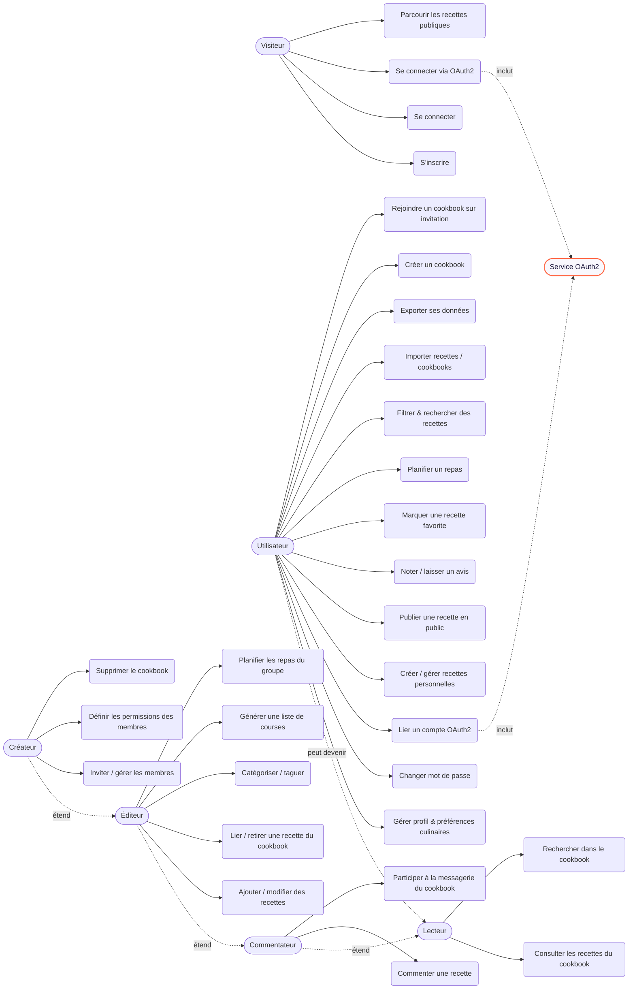

# SUPMEAL — Diagramme de cas d'utilisation

> Les ovales (`(...)`) figurent les cas d'utilisation,
> les formes (`[...]`) figurent les acteurs.

## Acteurs

- **Visiteur** : non authentifié.
- **Utilisateur** : compte authentifié (gère son espace personnel).
- **Rôles au sein d'un cookbook partagé** (tous sont des utilisateurs **authentifiés et
  membres** — un cookbook n'est pas public ; héritage croissant de droits) :
  **Lecteur → Commentateur → Éditeur → Créateur**.
  - *Lecteur* = membre en **lecture seule** (consulte/recherche, ne contribue pas).
  - *Commentateur* = + commente les recettes et participe à la messagerie.
  - *Éditeur* = + ajoute/modifie/lie des recettes, tague, planifie, génère la liste de courses.
  - *Créateur* = + gère membres/permissions et supprime le cookbook.
- **Service OAuth2** (Google) : acteur secondaire (système externe).

## Diagramme



## Notes de conception

- **Espace personnel vs cookbook** : une recette appartient toujours à un **créateur**
  (`ownerId`) et peut être **liée à un ou plusieurs cookbooks** via la table de liaison
  `CookbookRecipe`. Aucune liaison → recette personnelle. **Retirer** une recette d'un
  cookbook supprime la liaison, **pas la recette**.
- Les permissions par rôle (Lecteur/Commentateur/Éditeur/Créateur) seront appliquées
  côté serveur par des **middlewares d'autorisation** (vérification du rôle dans la table
  `CookbookMembership`). Voir la matrice complète dans le dossier de conception.
- La **planification** peut être **personnelle ou de groupe** (`MealPlanEntry.cookbookId`
  nullable) → un cookbook familial partage son planning.
```
