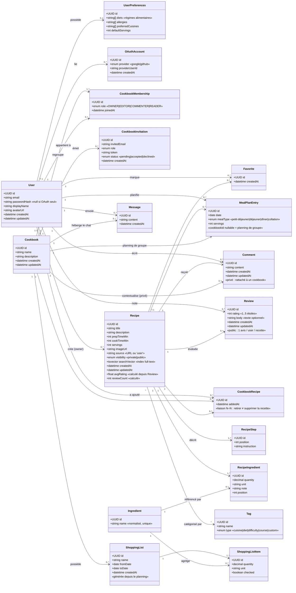

# SUPMEAL — Diagramme de classes (modèle de domaine)

C'est la pièce centrale : le schéma de base de données et les diagrammes de séquence
en découlent directement.



## Choix de modélisation (à justifier dans la doc technique)

| Décision | Justification |
|---|---|
| **`CookbookRecipe` (liaison N–N)** | Une recette a un **créateur unique** (`ownerId`) et existe indépendamment ; elle peut être **partagée dans plusieurs cookbooks**. Retirer une recette d'un cookbook = supprimer la ligne de liaison, **sans détruire la recette**. Couvre aussi le cas « recette personnelle » = aucune liaison. |
| `RecipeIngredient` comme classe-association | Stocke **quantité + unité** propres au couple (recette, ingrédient), avec une table `Ingredient` **normalisée et unique** → recherche par ingrédient optimisée, sans duplication. |
| `Ingredient` séparé | « farine » partagée par toutes les recettes → index unique, filtrage rapide, agrégation pour la liste de courses. |
| `searchVector` (tsvector) sur `Recipe` | **Recherche plein texte native PostgreSQL** (titre + description + ingrédients) avec index GIN. |
| `CookbookMembership.role` | Implémente les 4 rôles **OWNER/EDITOR/COMMENTER/READER** (un membre = un rôle par cookbook). Permissions appliquées par middleware serveur. |
| `MealPlanEntry.cookbookId` **nullable** | `null` = planning personnel ; renseigné = **planning de groupe** partagé (ex. cookbook familial). |
| `Message` (chat cookbook) ≠ `Comment` (par recette) | Deux besoins distincts : messagerie instantanée de groupe vs commentaire ciblé. |
| **`Comment` rattaché au cookbook** (`cookbookId`) | Les conseils restent **privés au groupe** : pas de fuite inter-cookbooks quand une recette est partagée dans plusieurs cookbooks. Permission via `requireRole(COMMENTER)`. |
| **`Review` (avis) ≠ `Comment`** | L'avis est **public** (visible partout où la recette l'est), porte une note `1..5` + texte, `UNIQUE(recipe, user)`. Alimente `avgRating` (base de suggestions). Distinct de la discussion privée du cookbook. |
| **`Recipe.visibility`** `private`\|`public` | `private` (défaut) = créateur + membres des cookbooks ; `public` = visible de tous + page de **découverte**. Bascule réservée au créateur. *(Bonus — à implémenter en dernier.)* |
| `ShoppingList` / `ShoppingListItem` *(bonus)* | **Générées depuis le planning** sur une plage de dates : agrégation des `RecipeIngredient` par ingrédient/unité, avec cases à cocher. |
| `RecipeStep.position` | Étapes ordonnées et réordonnables. |
```
