# SUPMEAL — Schéma de la base de données (PostgreSQL)

Modèle relationnel dérivé du [diagramme de classes](02-diagramme-classes.md).
Toutes les clés primaires sont des `UUID`. Les tables d'association portent des clés
étrangères et des contraintes d'unicité pour éviter les doublons.

```mermaid
erDiagram
  USER ||--o| USER_PREFERENCES : "a"
  USER ||--o{ OAUTH_ACCOUNT : "lie"
  USER ||--o{ RECIPE : "crée"
  USER ||--o{ FAVORITE : "marque"
  USER ||--o{ MEAL_PLAN_ENTRY : "planifie"
  USER ||--o{ COMMENT : "écrit"
  USER ||--o{ REVIEW : "note"
  USER ||--o{ MESSAGE : "envoie"
  USER ||--o{ COOKBOOK_MEMBERSHIP : "membre"
  USER ||--o{ COOKBOOK_RECIPE : "a ajouté"

  COOKBOOK ||--o{ COOKBOOK_MEMBERSHIP : "regroupe"
  COOKBOOK ||--o{ COOKBOOK_INVITATION : "émet"
  COOKBOOK ||--o{ COOKBOOK_RECIPE : "agrège"
  COOKBOOK ||--o{ MESSAGE : "héberge"
  COOKBOOK ||--o{ COMMENT : "contextualise"
  COOKBOOK ||--o{ MEAL_PLAN_ENTRY : "planning groupe"
  COOKBOOK ||--o{ SHOPPING_LIST : "possède"

  RECIPE ||--o{ COOKBOOK_RECIPE : "liée"
  RECIPE ||--o{ RECIPE_STEP : "a"
  RECIPE ||--o{ RECIPE_INGREDIENT : "compose"
  RECIPE ||--o{ FAVORITE : "favori"
  RECIPE ||--o{ MEAL_PLAN_ENTRY : "planifiée"
  RECIPE ||--o{ COMMENT : "commentée"
  RECIPE ||--o{ REVIEW : "évaluée"
  RECIPE ||--o{ RECIPE_TAG : "taguée"

  INGREDIENT ||--o{ RECIPE_INGREDIENT : "référencé"
  INGREDIENT ||--o{ SHOPPING_LIST_ITEM : "agrégé"
  TAG ||--o{ RECIPE_TAG : "appliqué"
  SHOPPING_LIST ||--o{ SHOPPING_LIST_ITEM : "contient"

  USER {
    uuid id PK
    varchar email UK
    varchar password_hash "nullable (OAuth)"
    varchar display_name
    varchar avatar_url
    timestamptz created_at
    timestamptz updated_at
  }
  USER_PREFERENCES {
    uuid id PK
    uuid user_id FK,UK
    text[] diets
    text[] allergies
    text[] preferred_cuisines
    int default_servings
  }
  OAUTH_ACCOUNT {
    uuid id PK
    uuid user_id FK
    varchar provider "google|microsoft|github"
    varchar provider_user_id
    timestamptz created_at
  }
  COOKBOOK {
    uuid id PK
    varchar name
    text description
    timestamptz created_at
    timestamptz updated_at
  }
  COOKBOOK_MEMBERSHIP {
    uuid id PK
    uuid cookbook_id FK
    uuid user_id FK
    varchar role "OWNER|EDITOR|COMMENTER|READER"
    timestamptz joined_at
  }
  COOKBOOK_INVITATION {
    uuid id PK
    uuid cookbook_id FK
    varchar invited_email
    varchar role
    varchar token UK
    varchar status "pending|accepted|declined"
    timestamptz created_at
  }
  RECIPE {
    uuid id PK
    uuid owner_id FK "créateur"
    varchar title
    text description
    int prep_time_min
    int cook_time_min
    int servings
    varchar image_url
    varchar source
    varchar visibility "private|public"
    tsvector search_vector "index GIN"
    timestamptz created_at
    timestamptz updated_at
  }
  COOKBOOK_RECIPE {
    uuid id PK
    uuid cookbook_id FK
    uuid recipe_id FK
    uuid added_by FK
    timestamptz added_at
  }
  RECIPE_STEP {
    uuid id PK
    uuid recipe_id FK
    int position
    text instruction
  }
  INGREDIENT {
    uuid id PK
    varchar name UK "normalisé"
  }
  RECIPE_INGREDIENT {
    uuid id PK
    uuid recipe_id FK
    uuid ingredient_id FK
    numeric quantity
    varchar unit
    varchar note
    int position
  }
  TAG {
    uuid id PK
    varchar name
    varchar type "cuisine|diet|difficulty|custom"
  }
  RECIPE_TAG {
    uuid recipe_id FK
    uuid tag_id FK
  }
  FAVORITE {
    uuid id PK
    uuid user_id FK
    uuid recipe_id FK
    timestamptz created_at
  }
  MEAL_PLAN_ENTRY {
    uuid id PK
    uuid user_id FK
    uuid cookbook_id FK "nullable = groupe"
    uuid recipe_id FK
    date date
    varchar meal_type "breakfast|lunch|dinner|snack"
    int servings
  }
  COMMENT {
    uuid id PK
    uuid recipe_id FK
    uuid cookbook_id FK
    uuid user_id FK
    text content
    timestamptz created_at
    timestamptz updated_at
  }
  REVIEW {
    uuid id PK
    uuid recipe_id FK
    uuid user_id FK
    smallint rating "1..5"
    text body "optionnel"
    timestamptz created_at
    timestamptz updated_at
  }
  MESSAGE {
    uuid id PK
    uuid cookbook_id FK
    uuid user_id FK
    text content
    timestamptz created_at
  }
  SHOPPING_LIST {
    uuid id PK
    uuid cookbook_id FK "nullable = perso"
    uuid user_id FK
    varchar name
    date from_date
    date to_date
    timestamptz created_at
  }
  SHOPPING_LIST_ITEM {
    uuid id PK
    uuid shopping_list_id FK
    uuid ingredient_id FK
    numeric quantity
    varchar unit
    boolean checked
  }
```



## Index & contraintes clés (pour l'optimisation — points « qualité du code »)

| Élément | But |
|---|---|
| `GIN (search_vector)` sur `RECIPE` | Recherche plein texte rapide (titre + description + ingrédients agrégés). |
| `UNIQUE (name)` sur `INGREDIENT` | Évite les doublons d'ingrédients, accélère filtrage et agrégation. |
| `UNIQUE (cookbook_id, recipe_id)` sur `COOKBOOK_RECIPE` | Une recette n'est liée qu'une fois à un cookbook donné. |
| `UNIQUE (cookbook_id, user_id)` sur `COOKBOOK_MEMBERSHIP` | Un seul rôle par membre et par cookbook. |
| `UNIQUE (user_id, recipe_id)` sur `FAVORITE` | Un favori unique par couple. |
| `UNIQUE (recipe_id, user_id)` sur `REVIEW` | **Un seul avis par utilisateur et par recette.** |
| `UNIQUE (recipe_id, cookbook_id, user_id, ...)` non requis sur `COMMENT` | Plusieurs commentaires possibles ; `cookbook_id` garde le fil **privé au cookbook**. |
| Index sur `RECIPE.visibility` (partiel `WHERE visibility='public'`) | **Page de découverte** : listing rapide des recettes publiques. |
| `UNIQUE (recipe_id, tag_id)` sur `RECIPE_TAG` | Pas de tag dupliqué sur une recette. |
| Index sur `COOKBOOK_RECIPE.cookbook_id` / `.recipe_id` | Listing rapide des recettes d'un cookbook et des cookbooks d'une recette. |
| Index sur `RECIPE.owner_id` | Listing des recettes personnelles d'un utilisateur. |
| Index sur `RECIPE_INGREDIENT.ingredient_id` | Filtrage « recettes contenant tel ingrédient ». |
| `ON DELETE CASCADE` (steps, ingredients, tags, comments, liaisons d'une recette) | Intégrité référentielle automatique ; retirer un cookbook supprime ses liaisons mais pas les recettes. |
```
