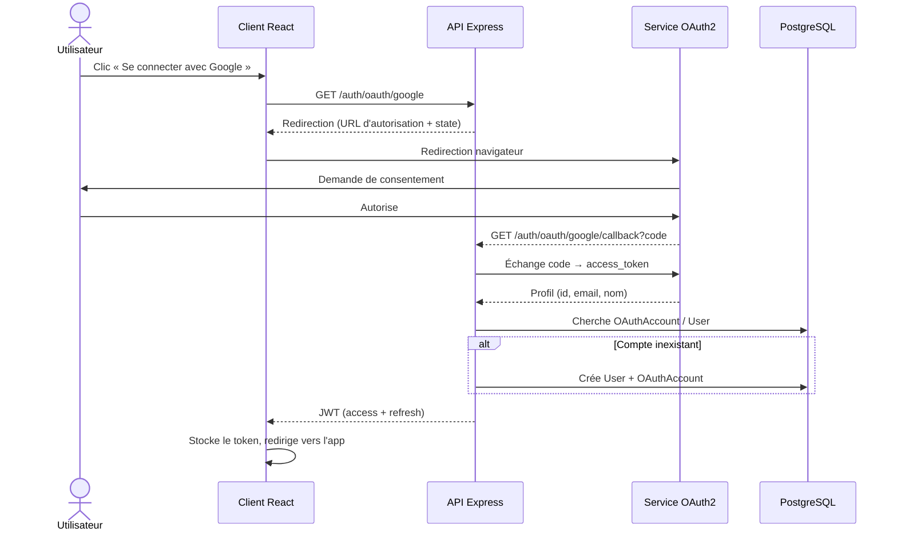
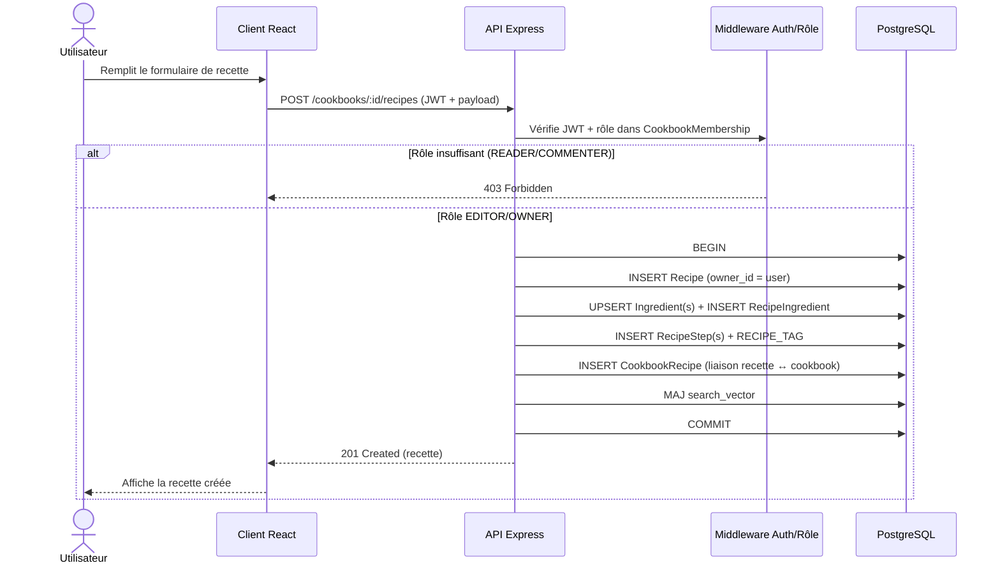
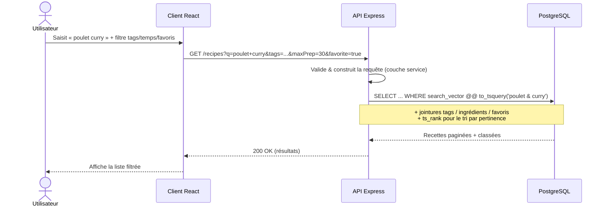
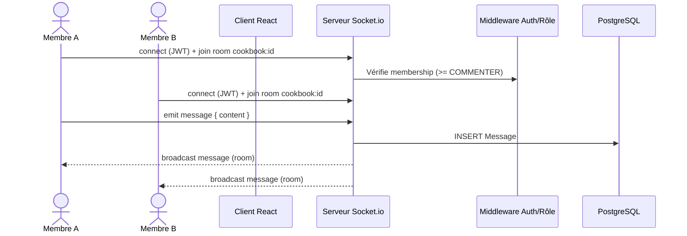
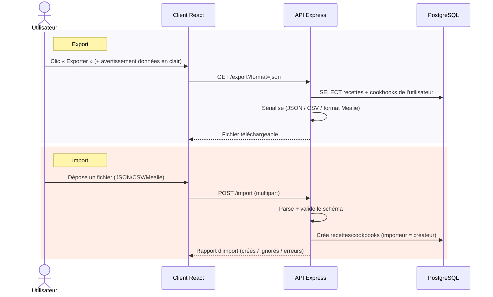

# SUPMEAL — Diagrammes de séquence

Flux clés de l'application. Tous passent par l'API REST (le client web ne contient
aucune logique métier).

## 1. Connexion via OAuth2 (ex. Google)

## 2. Ajout d'une recette dans un cookbook (avec contrôle de permission)

## 3. Recherche plein texte + filtres

## 4. Messagerie instantanée du cookbook (WebSocket)

## 5. Import / Export de données

