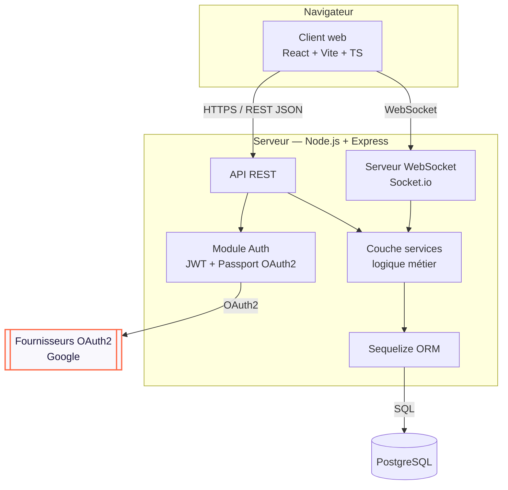
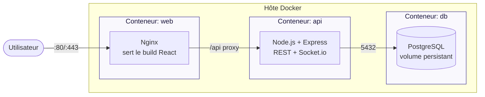

# SUPMEAL — Architecture & déploiement

## Diagramme de composants (les 3 briques)



> **Contrainte du sujet respectée** : toute la logique métier est dans la couche
> `services` du serveur. Le client React ne fait qu'afficher et relayer les requêtes.

## Diagramme de déploiement (Docker Compose)



## Services `docker-compose.yml` (cible)

| Service | Rôle | Notes |
|---|---|---|
| `web` | Client React buildé, servi par Nginx | Proxy `/api` → service `api`. |
| `api` | Serveur Express (REST + WebSocket) | Variables d'env pour secrets (JWT, OAuth, DB) — **jamais en clair dans le code**. |
| `db` | PostgreSQL | Volume nommé pour la persistance. `.env` exclu du dépôt (`.gitignore`). |

> ≥ 3 services distincts ✅ — l'application doit pouvoir démarrer intégralement
> via `docker compose up`.

## Gestion des secrets (anti-malus)

- Tous les secrets (clés OAuth2, secret JWT, mot de passe DB) passent par des
  **variables d'environnement** injectées via `docker-compose` + fichier `.env`.
- `.env` est ajouté au `.gitignore` ; un `.env.example` documenté est versionné à la place.
- Mots de passe utilisateurs **hashés** (bcrypt/argon2) — jamais en clair (sinon ajournement).
```
