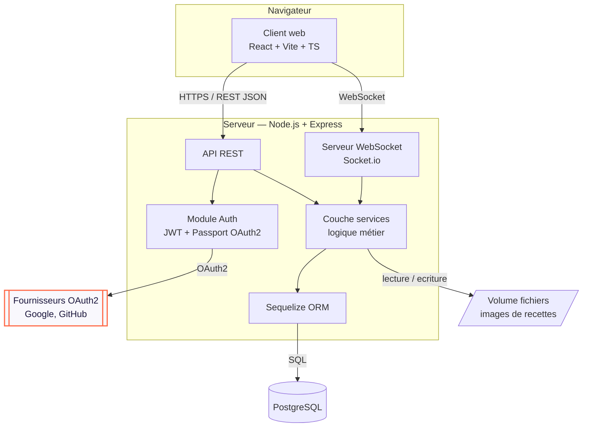
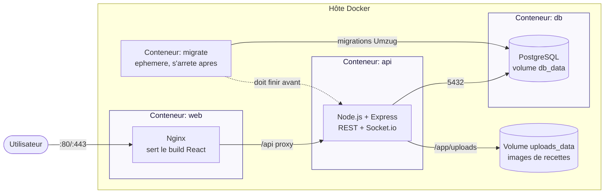

# SUPMEAL — Architecture & déploiement

## Diagramme de composants (les 3 briques)

> **Contrainte du sujet respectée** : toute la logique métier est dans la couche
> `services` du serveur. Le client React ne fait qu'afficher et relayer les requêtes.

## Diagramme de déploiement (Docker Compose)

## Services `docker-compose.yml`

| Service | Rôle | Notes |
|---|---|---|
| `web` | Client React buildé, servi par Nginx | Proxy `/api` → service `api`. |
| `api` | Serveur Express (REST + WebSocket) | Variables d'env pour secrets (JWT, OAuth, DB) — **jamais en clair dans le code**. Volume `uploads_data` monté sur `/app/uploads`. |
| `db` | PostgreSQL | Volume `db_data` pour la persistance. `.env` exclu du dépôt (`.gitignore`). |
| `migrate` | Applique les migrations Umzug puis s'arrête | Éphémère (`restart: "no"`). `api` attend sa terminaison réussie (`service_completed_successfully`), pour qu'aucune requête n'atteigne un schéma incomplet. |

> ≥ 3 services distincts ✅ — l'application doit pouvoir démarrer intégralement
> via `docker compose up`.

## Volumes nommés

| Volume | Monté sur | Contenu |
|---|---|---|
| `db_data` | `db:/var/lib/postgresql/data` | Données PostgreSQL. |
| `uploads_data` | `api:/app/uploads` | Images de recettes envoyées par les utilisateurs. |

Les images sont stockées **hors du conteneur** : sans ce volume, chaque
reconstruction de l'image Docker les effacerait. En base, seul un chemin
relatif est conservé (`/uploads/recipes/<uuid>.jpg`), rendu absolu à la
sortie de l'API — un changement d'URL publique n'invalide donc rien.

## Gestion des secrets (anti-malus)

- Tous les secrets (clés OAuth2, secret JWT, mot de passe DB) passent par des
  **variables d'environnement** injectées via `docker-compose` + fichier `.env`.
- `.env` est ajouté au `.gitignore` ; un `.env.example` documenté est versionné à la place.
- Mots de passe utilisateurs **hashés** (bcrypt, coût 12) — jamais en clair.
