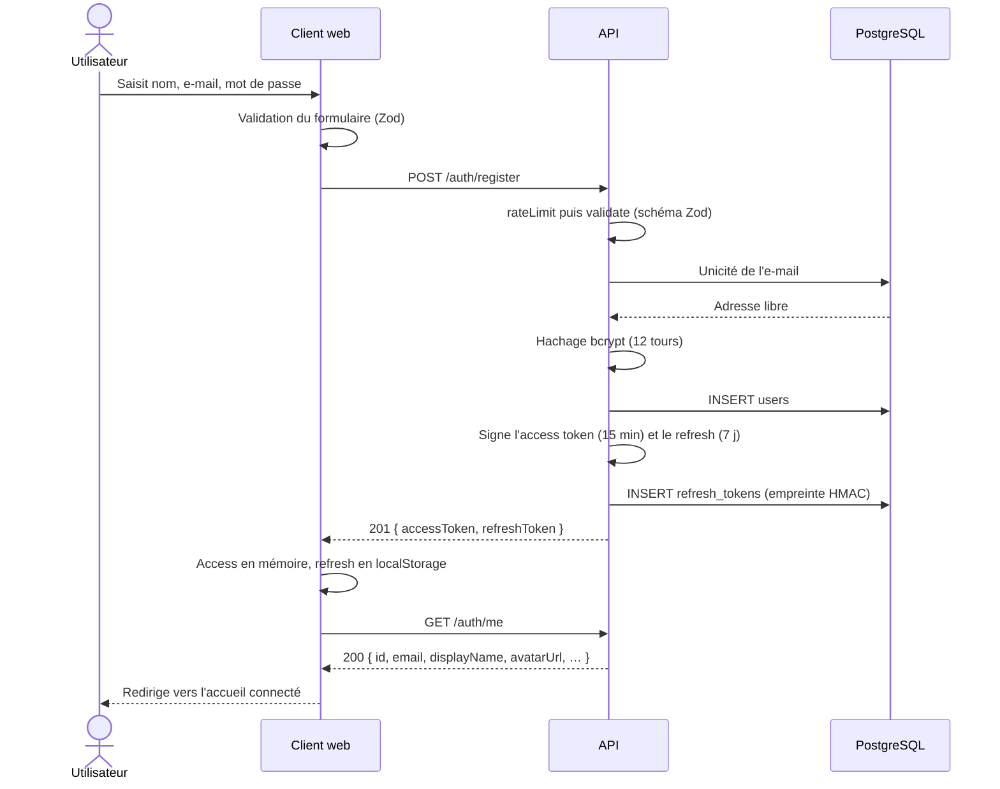
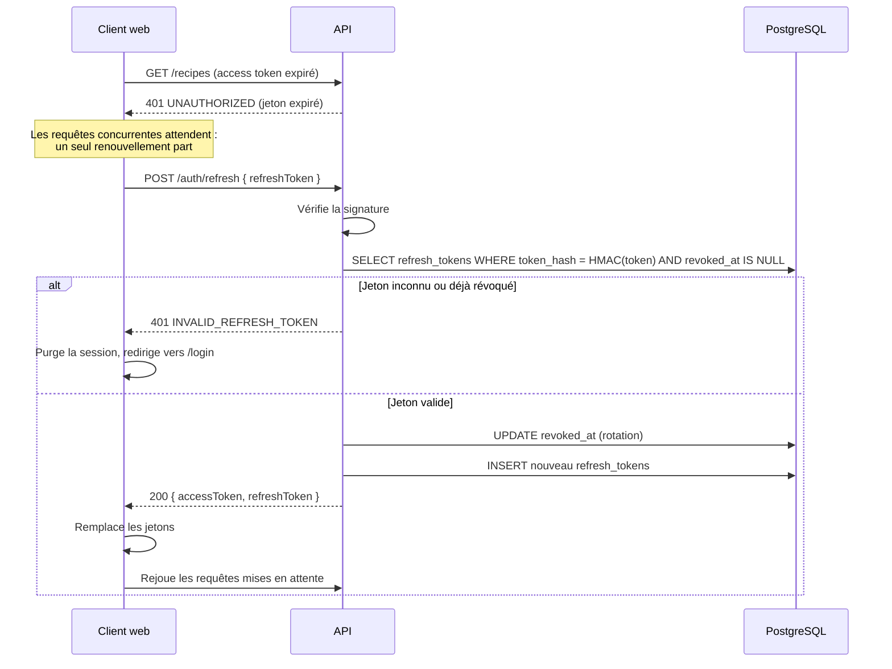
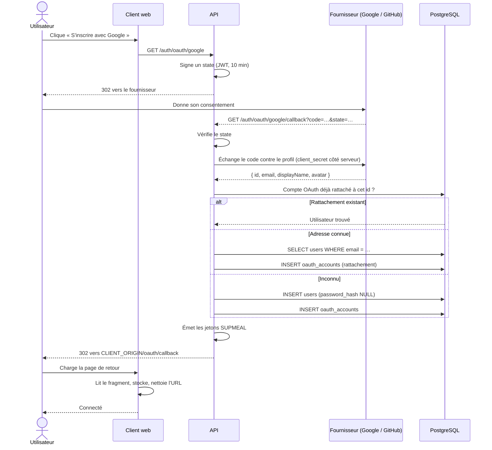
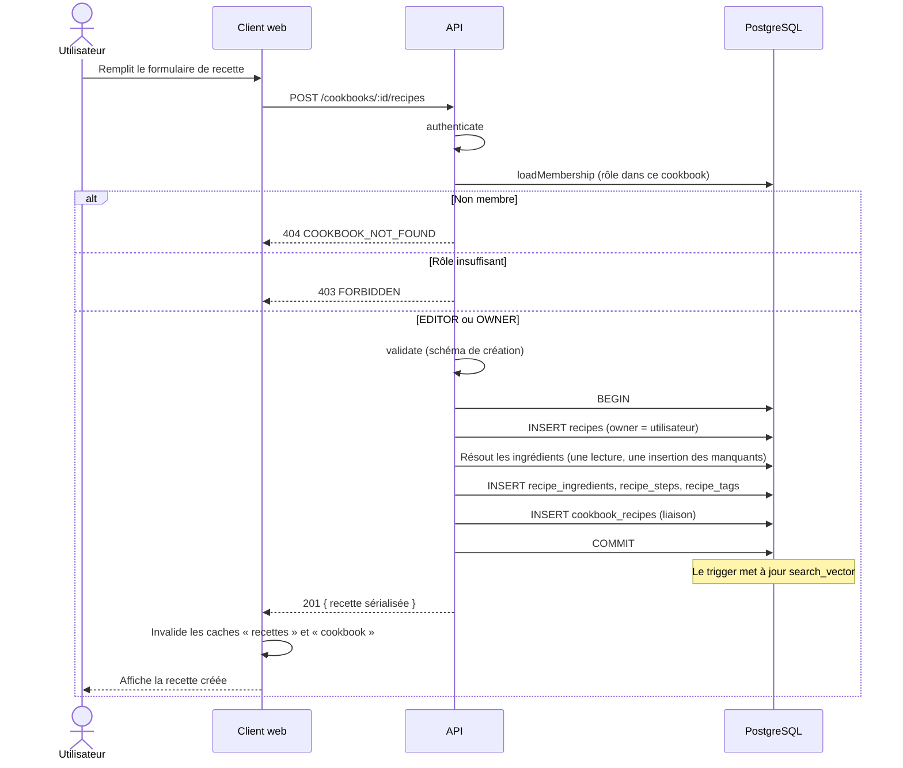
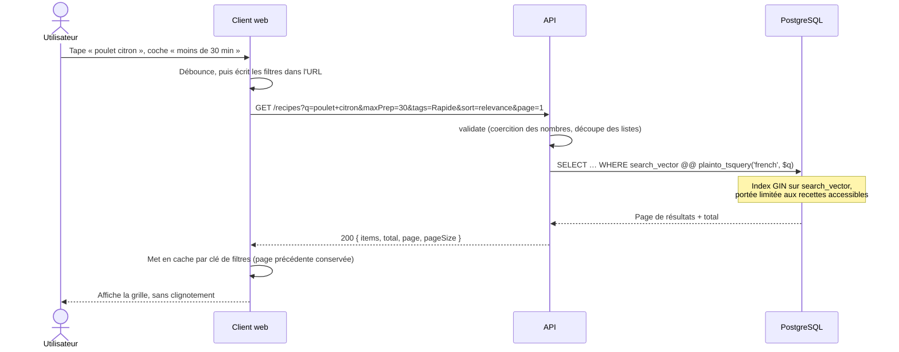
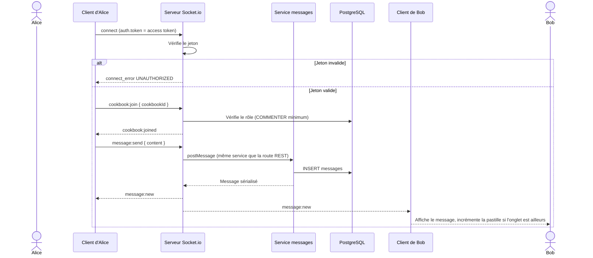
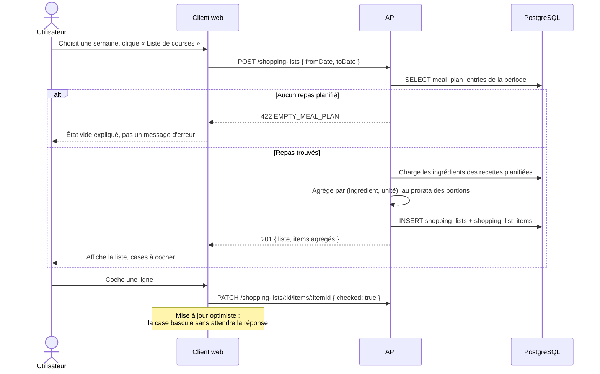
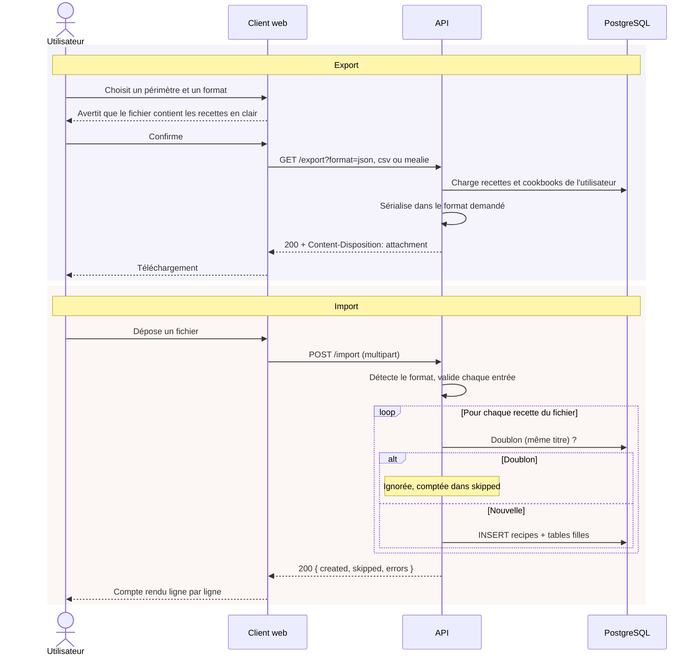

# Documentation Technique — SUPMEAL

**Evan Morvant**

## Table des matières

1. [Présentation du projet](#1-présentation-du-projet)
2. [Prérequis et installation](#2-prérequis-et-installation)
3. [Guide de déploiement](#3-guide-de-déploiement)
4. [Justification des choix technologiques](#4-justification-des-choix-technologiques)
5. [Architecture du backend](#5-architecture-du-backend)
6. [Architecture du client web](#6-architecture-du-client-web)
7. [Modèle de données](#7-modèle-de-données)
8. [Diagrammes de séquence](#8-diagrammes-de-séquence)
9. [Architecture de l'API REST](#9-architecture-de-lapi-rest)
10. [Sécurité](#10-sécurité)
11. [Tests et vérification](#11-tests-et-vérification)
12. [Annexe](#12-annexe)

---

## 1. Présentation du projet

### 1.1 Contexte

SUPMEAL est une application web de gestion de recettes et de planification de repas, développée pour la société **SUPMEAL Pro**, qui la veut alternative aux solutions existantes du marché — Mealie, Tandoor Recipes, Paprika — souvent limitées ou payantes. Elle permet à chacun de rassembler ses recettes, de les partager dans des carnets collectifs appelés **cookbooks**, de planifier ses repas de la semaine et d'en déduire une liste de courses.

### 1.2 Fonctionnalités principales

- **Comptes** : inscription par e-mail et mot de passe ou via un compte Google ou GitHub (OAuth2), modification du profil, changement de mot de passe, liaison et déliaison des comptes tiers.
- **Recettes** : création, modification, suppression, image de couverture, ingrédients avec quantités et unités, étapes ordonnées, tags, favoris, visibilité privée ou publique.
- **Recherche** : recherche plein texte sur le titre, la description et les ingrédients, filtrée par tags, ingrédients, temps de préparation et de cuisson, favoris, avec trois ordres de tri et pagination.
- **Découverte** : catalogue public consultable **sans compte**, avec avis et notes.
- **Cookbooks** : carnets partagés à quatre rôles (`READER`, `COMMENTER`, `EDITOR`, `OWNER`), invitations par jeton, gestion des membres, commentaires par recette.
- **Messagerie** : salon de discussion temps réel par cookbook, en WebSocket, avec historique paginé et repli REST.
- **Avis** : un avis public par personne et par recette, note de 1 à 5, moyenne tenue sur la recette.
- **Planning** : grille hebdomadaire par créneau (petit-déjeuner, déjeuner, dîner, collation), personnelle ou partagée avec un cookbook.
- **Listes de courses** : génération depuis une fenêtre du planning, avec agrégation des ingrédients par unité, et cases à cocher.
- **Suggestions** : recettes proposées selon les préférences déclarées et l'historique, avec les **motifs affichés en clair**.
- **Import / export** : export des recettes et cookbooks en JSON, CSV ou format Mealie ; import d'un fichier avec compte rendu ; export séparé des données personnelles (portabilité RGPD).

### 1.3 Architecture globale

Trois briques distinctes, orchestrées par Docker Compose, communiquant par une API REST :

```
                  ┌──────────────────────┐
                  │     Client web       │
                  │  React + Vite (SPA)  │
                  │   servi par Nginx    │
                  │      Port 8080       │
                  └──────────┬───────────┘
                             │  HTTP REST (/api/) + WebSocket (/socket.io/)
                             │  proxifiés par Nginx vers l'API
                  ┌──────────▼───────────┐
                  │      API REST        │
                  │ Express + Socket.io  │
                  │     TypeScript       │
                  │      Port 4000       │
                  └──────────┬───────────┘
           ┌─────────────────┴──────────────────┐
  ┌────────▼─────────┐              ┌───────────▼──────────┐
  │   PostgreSQL 16  │              │  Images de recettes  │
  │  (toutes les     │              │   (volume Docker)    │
  │   données)       │              │     /app/uploads     │
  │  réseau interne  │              └──────────────────────┘
  └──────────────────┘
```

Le client est une **interface pure** : il n'embarque aucune règle métier. Les permissions qu'il affiche viennent du rôle renvoyé par l'API, jamais d'un calcul local qui doublerait celui du serveur. 

Les images de recettes ne sont pas stockées en base : seul leur chemin l'est, les fichiers vivant sur un volume Docker.

---

## 2. Prérequis et installation

### 2.1 Prérequis système

| Outil | Version minimale | Utilité |
|---|---|---|
| Docker | 24.x | Conteneurisation des services |
| Docker Compose | 2.x | Orchestration multi-conteneurs |
| Git | 2.x | Clonage du dépôt |

Node.js n'est **pas** nécessaire pour déployer : tout est construit dans les images. Il ne l'est que pour développer hors Docker (§ 3.10).

### 2.2 Dépendances principales

**Backend** :

| Dépendance | Version | Rôle |
|---|---|---|
| express | 4.19 | Framework HTTP |
| typescript | 5.5 | Typage statique, compilé vers `dist/` |
| sequelize | 6.37 | ORM PostgreSQL |
| pg | 8.12 | Driver PostgreSQL |
| umzug | 3.8 | Exécution et suivi des migrations |
| zod | 3.23 | Validation des corps, paramètres et requêtes |
| jsonwebtoken | 9.0 | Signature et vérification des jetons |
| bcryptjs | 2.4 | Hachage des mots de passe |
| passport | 0.7 | Socle OAuth2 |
| passport-google-oauth20 | 2.0 | Stratégie Google |
| passport-github2 | 0.1 | Stratégie GitHub |
| socket.io | 4.7 | Messagerie temps réel |
| multer | 2.2 | Réception des fichiers envoyés |
| helmet | 7.1 | En-têtes HTTP de sécurité |
| cors | 2.8 | Politique d'origine croisée |
| express-rate-limit | 7.4 | Limitation de débit sur l'authentification |
| morgan | 1.10 | Journalisation des requêtes |
| swagger-ui-express | 5.0 | Service de la spécification OpenAPI |
| vitest + supertest | 2.1 / 7.0 | Tests d'intégration (développement) |

**Client web** :

| Dépendance | Version | Rôle |
|---|---|---|
| react | 18.3 | Bibliothèque d'interface |
| vite | 5.3 | Outil de build et serveur de développement |
| typescript | 5.5 | Typage statique |
| react-router-dom | 6.24 | Routage côté client |
| @tanstack/react-query | 5.101 | État serveur : cache, invalidation, pagination |
| axios | 1.7 | Client HTTP et intercepteurs |
| react-hook-form | 7.85 | Gestion des formulaires |
| zod | 4.4 | Validation des formulaires |
| socket.io-client | 4.8 | Messagerie temps réel |
| date-fns | 4.4 | Calcul des semaines du planning |
| @fontsource… | 5.3 | Polices auto-hébergées (Bricolage Grotesque, Instrument Sans, IBM Plex Mono) |

Aucun framework CSS ni bibliothèque de composants : l'interface repose sur des **CSS Modules** et des variables CSS (§ 4.4).

---

## 3. Guide de déploiement

### 3.1 Déploiement

Le fil complet, d'un dépôt vide à une application peuplée et vérifiée. Les
sous-sections qui suivent détaillent chaque étape.

**Prérequis** : Docker et Docker Compose. Node.js n'est pas nécessaire ici.

```bash
# 1 — Récupérer le projet ou dézipper l'archive
git clone https://github.com/Evan-Morvant/SupMeal.git supmeal
cd supmeal

# 2 — Créer le fichier d'environnement
cp .env.example .env

# 3 — Générer les secrets JWT
openssl rand -hex 32
# ou, avec Docker :
docker run --rm node:20-alpine node -e "console.log(require('crypto').randomBytes(32).toString('hex'))"
```

Reporter les deux valeurs obtenues dans le `.env` — et non dans le `.env.example` — sur `JWT_ACCESS_SECRET` et `JWT_REFRESH_SECRET` : ceux livrés en exemple font 23 caractères, sous le minimum de 32, l'API refuse de démarrer avec. 
Choisir ensuite un `POSTGRES_PASSWORD` et le recopier à l'identique dans `DATABASE_URL`. Pour un vrai déploiement, passer aussi `NODE_ENV` à `production`.

Tout le reste a un défaut utilisable en local, identifiants OAuth2 compris : non
renseignés, les deux fournisseurs ne sont simplement pas enregistrés et leurs
endpoints répondent `503`, sans gêner l'application. Détail de chaque variable
au § 3.4.

```bash
# 4 — Monter la pile, jeu de données compris
docker compose --profile seed up -d --build

# 5 — Vérifier
docker compose ps                            # migrate et seed en « Exited (0) »
curl http://localhost:4000/api/v1/health     # "status":"ok"
```
Tout est prêt. Vous pouvez ensuite ouvrir **http://localhost:8080** et vous connecter avec votre compte en le créant, ou avec le compte `camille.roux@supmeal.fr` / `Motdepasse123!` — c'est le compte le plus fourni du jeu de données.

Les trois commandes du quotidien, une fois la pile connue :

```bash
docker compose down                             # arrêt, données conservées
docker compose down -v                          # arrêt et effacement des données
docker compose run --rm -e SEED_RESET=1 seed    # repartir d'un jeu de données neuf
```

Ce fil vérifie que la pile monte. Pour éprouver l'application elle-même —
parcours HTTP complets, API réellement démarrée, interface conduite dans un
navigateur — voir la section 11 ; ces dispositifs demandent l'installation
Node décrite au § 3.10.

### 3.2 Structure du dépôt

```
4resit/
├── client/                    # Client web React
│   ├── src/
│   ├── nginx.conf             # Service des fichiers + proxy /api et /socket.io
│   └── Dockerfile
├── server/                    # API REST
│   ├── src/
│   ├── test/
│   ├── scripts/               # Scénarios de démonstration et peuplement
│   ├── openapi.yaml           # Contrat d'API (design-first)
│   └── Dockerfile
├── docs/
│   ├── conception/            # Dossier de conception UML
│   ├── documentation-technique.md
│   ├── oauth-google.md
│   └── oauth-github.md
├── .env.example
└── docker-compose.yml
```

Six dossiers du dépôt portent leur propre README, au plus près de ce qu'ils
décrivent ; avec celui de la racine, cela fait sept. Ils sont récapitulés en [annexe](#12-annexe).

### 3.3 Récupérer le projet

**Depuis une archive ZIP** : extraire l'archive, puis se placer à la racine du dossier extrait.

**Depuis Git** :

```bash
git clone https://github.com/Evan-Morvant/SupMeal.git supmeal
cd supmeal
```

### 3.4 Configuration des variables d'environnement

Un seul fichier `.env`, à la racine, lu par Docker Compose et injecté dans les services. Un `.env.example` sert de point de départ :

```bash
cp .env.example .env
```

**Deux secrets sont obligatoires et n'ont aucune valeur de repli** : l'API refuse de démarrer sans eux, avec un message explicite. Les générer :

```bash
openssl rand -hex 32
```

Sans `openssl`, la commande via Docker est donnée au § 3.1.

Lancer la commande deux fois — le schéma d'environnement exige au moins
32 caractères par secret — et reporter les valeurs, dans le .env, pas le .env.exemple attention (oui... je l'ai fait...) :

```env
# --- PostgreSQL (service db) ---
POSTGRES_USER=supmeal
POSTGRES_PASSWORD=<mot_de_passe>
POSTGRES_DB=supmeal

# --- API (service api) ---
NODE_ENV=production
API_PORT=4000
DATABASE_URL=postgres://supmeal:<mot_de_passe>@db:5432/supmeal
JWT_ACCESS_SECRET=<première valeur générée>
JWT_REFRESH_SECRET=<seconde valeur générée>
JWT_ACCESS_TTL=15m
JWT_REFRESH_TTL=7d
CLIENT_ORIGIN=http://localhost:8080
API_PUBLIC_URL=http://localhost:4000
AUTH_RATE_LIMIT_MAX=20

# --- Images de recettes ---
UPLOAD_DIR=./uploads          # surchargé à /app/uploads par le service api
UPLOAD_MAX_BYTES=5242880      # 5 Mo

# --- OAuth2 (facultatif) ---
GOOGLE_CLIENT_ID=
GOOGLE_CLIENT_SECRET=
GITHUB_CLIENT_ID=
GITHUB_CLIENT_SECRET=

# --- Client web (service web) ---
WEB_PORT=8080
```

Les variables d'environnement OAuth2 sont **facultatives** : un fournisseur non renseigné n'est pas enregistré au démarrage, et ses endpoints répondent `503`. Le reste de l'application fonctionne. Afin de remplir ces variables, se référer aux procédures de création des applications OAuth2 : [`oauth-google.md`](oauth-google.md) et [`oauth-github.md`](oauth-github.md).

Quelques variables méritent une explication :

- **`CLIENT_ORIGIN`** sert deux fois : c'est la seule origine acceptée par CORS, et l'adresse vers laquelle l'API renvoie le navigateur à la fin d'un flux OAuth2. Elle doit désigner l'application réellement ouverte (`http://localhost:8080` en Docker).
- **`API_PUBLIC_URL`** est l'adresse publique de l'API. Elle préfixe les URL d'images renvoyées au client et construit les URI de callback OAuth2.
- **`AUTH_RATE_LIMIT_MAX`** borne les requêtes sur `/auth/register` et `/auth/login`, par IP et par quart d'heure.
- **`NODE_ENV`** vaut `development` dans le `.env.example` livré, qui sert d'abord au développement. Le passer à `production` pour un déploiement : l'image de l'API le définit déjà, mais `env_file` l'emporte sur la valeur de l'image.
- Les identifiants **OAuth2** sont facultatifs : un fournisseur non renseigné n'est simplement pas enregistré au démarrage, et ses endpoints répondent `503`. Le reste de l'application fonctionne. Procédure de création : [`oauth-google.md`](oauth-google.md) et [`oauth-github.md`](oauth-github.md).

> Changer les secrets JWT invalide les sessions ouvertes **et les invitations de cookbook en attente** : leur empreinte est calculée avec le secret de rafraîchissement.

### 3.5 Lancement avec Docker Compose

Depuis la racine du dépôt, une seule commande :

```bash
docker compose up -d --build                       # la pile, base vide
docker compose --profile seed up -d --build        # la pile, avec le jeu de données
```

La seconde ajoute le service `seed`, qui remplit une base neuve d'un jeu de données de démonstration (§ 3.9). C'est celle à préférer pour découvrir l'application : la première ouvre sur des écrans vides.

`--build` reconstruit les images : nécessaire au premier lancement et après toute modification du code source. Ensuite :

```bash
docker compose up          # démarrage simple
docker compose up -d       # en arrière-plan
docker compose down        # arrêt
docker compose down -v     # arrêt et suppression des volumes (efface toutes les données)
```

### 3.6 Services Docker

Cinq services, dont deux éphémères :

| Service | Image | Port publié | Rôle |
|---|---|---|---|
| `db` | postgres:16-alpine | aucun | Base de données |
| `migrate` | supmeal-api | — | Applique les migrations, puis s'arrête |
| `api` | supmeal-api | 4000 | API REST et serveur WebSocket |
| `seed` | supmeal-api | — | Remplit une base neuve, puis s'arrête — sous profil, voir § 3.5 |
| `web` | nginx (build React) | 8080 | Client web |

La base **n'est pas exposée** hors du réseau Docker : seule l'API la joint, sous le nom d'hôte `db`.

L'ordre de démarrage est contraint par des conditions, non par des attentes arbitraires : `migrate` attend que `db` soit saine (`pg_isready`), `api` attend que `migrate` se soit terminé avec succès, et `seed`, quand il est demandé, attend que `api` réponde sur `/api/v1/health`.

`migrate` et `seed` partagent l'image de l'API et ne diffèrent que par leur commande. Un service dédié aux migrations évite de les jouer au démarrage de l'API : si elles échouent, la pile s'arrête là, au lieu de servir une API branchée sur un schéma incomplet.

### 3.7 Volumes Docker

| Volume | Monté dans | Contenu |
|---|---|---|
| `db_data` | `/var/lib/postgresql/data` | Données PostgreSQL |
| `uploads_data` | `/app/uploads` | Images de recettes envoyées |

### 3.8 Vérification du déploiement

- **Application** : http://localhost:8080
- **API** : http://localhost:4000/api/v1 — santé sur `/health`
- **Swagger UI** : http://localhost:4000/api/v1/swagger — spécification brute sur `/api/v1/swagger/openapi.json`

État des conteneurs :

```bash
docker compose ps
```

`migrate` doit y figurer en `Exited (0)`, ainsi que `seed` s'il a été demandé : ce sont des tâches, pas des services permanents.

### 3.9 Jeu de données

Le service `seed` remplit une base neuve comme si l'application servait depuis huit mois : dix comptes, trente-quatre recettes écrites en entier, quatre cookbooks aux rôles variés, des avis, des commentaires, des discussions, un planning en cours et des listes de courses.

Il vit sous un **profil Compose** : la pile monte vide par défaut, et se peuple à la demande.

```bash
docker compose --profile seed up --build
```

Tous les comptes partagent le mot de passe `Motdepasse123!`. Le plus fourni est `camille.roux@supmeal.fr`.

Le service sort sans erreur quand le travail est déjà fait : le rejouer ne double rien. Pour repartir d'un jeu de données neuf sur une pile déjà debout :

```bash
docker compose run --rm -e SEED_RESET=1 seed
```

Détail du contenu et des garanties : [`server/scripts/seed/README.md`](../server/scripts/seed/README.md). Les photos des recettes ont le leur, qui fixe le nommage, le format attendu et la contrainte de licence — voir [annexe](#12-annexe).

### 3.10 Développement hors Docker

```bash
# Terminal 1 — API (nécessite un PostgreSQL joignable)
cd server && npm install && npm run dev

# Terminal 2 — Client
cd client && npm install && npm run dev
```

L'API écoute alors sur 4000 et le client sur 5173. `CLIENT_ORIGIN` doit valoir `http://localhost:5173` pour que CORS accepte le client de développement. Les scripts utiles côté serveur :

| Commande | Effet |
|---|---|
| `npm run migrate` | Applique les migrations en attente |
| `npm run migrate:status` | Liste les migrations appliquées et restantes |
| `npm test` | Suite de tests d'intégration |
| `npm run demo` | Scénarios de démonstration contre une API en marche |
| `npm run seed` | Peuplement de la base |

---

## 4. Justification des choix technologiques

### 4.1 Backend — Node.js / Express / TypeScript

**Node.js** avec **Express** a été retenu pour le serveur : c'est l'environnement que je maîtrise le mieux, ce qui évitait un temps d'apprentissage inutile sur un projet déjà large. Express reste par ailleurs bien adapté au besoin — une API REST sans traitement lourd, dont l'essentiel du travail consiste à valider, autoriser et interroger une base.

**TypeScript** est le choix qui a le plus pesé sur la qualité du résultat. Le contrat d'API ayant été écrit avant le code, les types servent de vérification continue entre ce qui a été promis et ce qui est implémenté : un champ renommé dans la sérialisation casse la compilation à tous ses points d'usage. Le client réutilise ces mêmes types, recopiés dans `client/src/api/types.ts`, ce qui aligne les deux briques sans les coupler.

**Express 4** plutôt que la version 5, encore récente au démarrage du projet : les erreurs asynchrones y sont prises en charge par un `asyncHandler` maison d'une dizaine de lignes, ce qui coûte moins qu'un pari sur une version dont l'écosystème n'était pas stabilisé.

### 4.2 Base de données — PostgreSQL + Sequelize

**PostgreSQL** s'imposait pour deux raisons précises, au-delà du caractère relationnel des données :

- la **recherche plein texte native** (`tsvector` + index GIN), qui évite d'ajouter un moteur de recherche externe à une application de cette taille ;
- les **tableaux natifs** (`text[]`), qui portent les régimes, allergies et cuisines préférées sans table de liaison pour des listes courtes et sans identité propre.

**Sequelize** comme ORM : il génère des requêtes paramétrées, ce qui écarte l'injection SQL par construction, et son typage TypeScript est suffisant pour ce projet. Les schémas ne sont toutefois **pas synchronisés automatiquement** : ils sont posés par des migrations SQL explicites (§ 5.6), parce que plusieurs objets du schéma — types énumérés, index partiels, `tsvector` maintenu par trigger — ne sont pas exprimables par `sync()`.

### 4.3 Temps réel — Socket.io

La messagerie de cookbook exige une diffusion immédiate à plusieurs destinataires. **Socket.io** apporte la gestion des salons, la reconnexion automatique et le repli en *long polling* quand le WebSocket est bloqué par un intermédiaire réseau — trois choses qu'il aurait fallu réécrire sur un WebSocket nu.

La messagerie reste **doublée d'un endpoint REST** (`POST /cookbooks/:id/messages`) : le temps réel accélère l'échange, il n'en est pas la condition. Un client sans WebSocket peut écrire et lire l'historique.

### 4.4 Client web — React / Vite / CSS Modules

**React** pour l'interface, **Vite** pour l'outillage : démarrage à chaud quasi instantané et build de production rapide.

**TanStack Query** gère l'état serveur. C'est le choix structurant du client : cache, invalidation après mutation, pagination et mises à jour optimistes sont fournis, là où un état global écrit à la main aurait recopié cette logique écran par écran. Les clés de cache sont centralisées dans `api/query-keys.ts` pour que les invalidations ne soient pas rédigées à la main à chaque appel.

**CSS Modules et variables CSS**, sans framework de style. Le sujet impose une charte graphique précise ; un framework utilitaire aurait fait porter les couleurs de la charte par des classes disséminées dans le JSX, alors que des variables CSS les tiennent en un seul fichier (`styles/tokens.css`). Les CSS Modules donnent en prime un isolement des noms de classes sans convention de nommage à respecter.

### 4.5 Validation — Zod

Toute donnée entrante traverse un schéma **Zod** avant d'atteindre un contrôleur : corps, paramètres d'URL et chaîne de requête. Deux bénéfices tiennent ensemble : le schéma **est** la source du type TypeScript, ce qui interdit la dérive entre validation et typage ; et la coercition (`z.coerce.number()`) traite proprement les paramètres de requête, qui arrivent toujours en chaînes de caractères.

Le client utilise Zod aussi, pour ses formulaires, sans partager les schémas du serveur : la validation cliente sert le confort d'usage, celle du serveur fait autorité.

### 4.6 Ce qui a été écarté

Un choix se comprend mieux avec ses alternatives :

- **Prisma** plutôt que Sequelize aurait donné un typage plus strict, mais son système de migrations s'accorde mal avec du SQL brut, dont le schéma a besoin (types énumérés, index partiels, trigger de recherche).
- **Next.js** aurait apporté un rendu côté serveur inutile ici : l'application est un outil derrière authentification, sans enjeu de référencement, et le sujet demande une brique cliente distincte de l'API.

---

## 5. Architecture du backend

### 5.1 Structure des dossiers

```
server/
├── src/
│   ├── index.ts            # Bootstrap : serveur HTTP, WebSocket, connexion BDD
│   ├── app.ts              # Construction de l'application Express
│   ├── routes.ts           # Routeur racine monté sur /api/v1
│   ├── config/             # Environnement, base de données, stratégies Passport
│   ├── common/             # Erreurs, jetons, sérialisation, CSV, normalisation
│   ├── middlewares/        # Authentification, rôles, validation, upload, erreurs
│   ├── models/             # Modèles Sequelize
│   ├── migrations/         # Migrations SQL numérotées
│   ├── modules/            # Un dossier par domaine métier
│   └── realtime/           # Serveur Socket.io et bus de diffusion
├── test/                   # Tests d'intégration
├── scripts/                # Scénarios de démonstration, peuplement
└── openapi.yaml            # Contrat d'API
```

Les scripts npm de l'API et son démarrage hors Docker sont décrits dans
[`server/README.md`](../server/README.md), rangé avec le code qu'il commande
([annexe](#12-annexe)).

### 5.2 Point d'entrée

`app.ts` construit l'application Express, séparément du démarrage du serveur — c'est ce qui permet aux tests de monter l'application en mémoire sans ouvrir de port. Dans l'ordre :

1. **`helmet()`** pose les en-têtes de sécurité.
2. **CORS** n'autorise que `CLIENT_ORIGIN`, et expose `Content-Disposition` — sans quoi le navigateur ne laisse pas le client lire le nom de fichier d'un export.
3. **Analyse JSON**, limitée à 5 Mo.
4. **Journalisation** par morgan, désactivée en test.
5. **Passport** est initialisé, et les stratégies OAuth2 enregistrées pour les seuls fournisseurs configurés.
6. **Fichiers statiques** : le dossier des images est servi avec une politique de ressource croisée, l'application et l'API n'étant pas sur la même origine.
7. **Routeur `/api/v1`**.
8. **Gestionnaires de 404 et d'erreurs**, en dernier.

`index.ts` monte ensuite le serveur HTTP, y greffe Socket.io, puis éprouve la connexion à la base avant d'écouter. Un échec de connexion est **journalisé sans empêcher le démarrage**, plutôt que de faire sortir le processus en boucle de redémarrage sous l'orchestrateur pendant que la base finit de se lever. En Docker, le cas ne se présente pas : `depends_on` attend que la base soit saine.

### 5.3 Anatomie d'un module

Chaque domaine occupe un dossier de `src/modules/` et suit toujours le même découpage :

| Fichier | Responsabilité |
|---|---|
| `*.routes.ts` | Déclaration des routes et **composition des middlewares** |
| `*.schemas.ts` | Schémas Zod des corps, paramètres et requêtes |
| `*.controller.ts` | Lecture de la requête, appel du service, choix du code HTTP |
| `*.service.ts` | Règles métier et accès aux données |

La règle est stricte : **un contrôleur ne contient pas de règle métier**, et un service ne connaît ni `req` ni `res`. C'est ce qui rend les services réutilisables — celui des messages sert aussi bien la route REST que le gestionnaire WebSocket.

Les dix-sept modules : `auth`, `users`, `recipes`, `discover`, `reviews`, `comments`, `cookbooks`, `invitations`, `messages`, `meal-plan`, `shopping-lists`, `suggestions`, `catalog`, `import-export`, `personal-data`, `health`, `docs`.

### 5.4 Middlewares

Les middlewares portent l'essentiel des règles d'accès. Les composer route par route rend la politique de sécurité **lisible dans la déclaration de la route**, plutôt que dispersée dans les contrôleurs.

#### `authenticate.ts`

- `authenticate` : extrait le jeton de l'en-tête `Authorization: Bearer`, vérifie la signature, renseigne `req.user`. Répond `401` si le jeton est absent, invalide ou expiré.
- `authenticateOptional` : même travail, mais laisse passer une requête anonyme. C'est ce qui permet à la découverte publique d'être enrichie pour un visiteur connecté — ses favoris apparaissent — sans dupliquer la route.

#### `validate.ts`

`validateBody`, `validateParams` et `validateQuery` appliquent un schéma Zod et **remplacent** la valeur d'origine par la valeur analysée. Le contrôleur reçoit donc des données déjà typées et coercées. Une violation devient un `400` détaillant les champs fautifs.

#### `load-membership.ts` et `require-role.ts`

- `loadMembership` charge l'adhésion de l'utilisateur au cookbook visé et la place sur la requête. Un non-membre reçoit `404`, et non `403` : répondre « interdit » révélerait l'existence du cookbook.
- `requireRole(min)` compare le rôle chargé à un minimum, selon la hiérarchie `READER < COMMENTER < EDITOR < OWNER`, et répond `403` s'il est insuffisant.

#### `recipe-access.ts`

Trois niveaux, parce qu'une recette n'a pas un propriétaire unique au sens des droits :

- `requireRecipeAccess` — lecture : autorisée au créateur, aux membres d'un cookbook contenant la recette, et à tout le monde si elle est publique.
- `requireRecipeEditor` — modification du contenu : créateur, ou éditeur d'un cookbook qui la contient.
- `requireRecipeOwner` — actions réservées au créateur : suppression, image, changement de visibilité.

#### `upload.ts`

Configure multer en deux variantes : les **images de recettes** vont sur disque, filtrées sur le type MIME (`image/png`, `image/jpeg`, `image/webp`) et bornées par `UPLOAD_MAX_BYTES` ; les **fichiers d'import** restent en mémoire, leur contenu étant analysé immédiatement. Les erreurs de multer sont converties en erreurs applicatives, pour que le client reçoive le même format d'erreur partout.

#### `rate-limit.ts`

Limite les requêtes sur `/auth/register` et `/auth/login` — les deux seules routes où un attaquant a intérêt à insister.

#### `error-handler.ts`

Point de sortie unique. Il traduit les `AppError` levées par les services, les erreurs Zod et les erreurs Sequelize vers un **format d'erreur uniforme** :

```json
{ "error": { "code": "FORBIDDEN", "message": "Rôle insuffisant", "details": [] } }
```

Le client s'appuie sur `code` pour ses messages, jamais sur le texte : c'est ce qui permet de reformuler un message côté serveur sans rien casser côté client.

### 5.5 Sérialisation

`common/serialize.ts` est le seul endroit qui transforme un modèle en réponse JSON. Il fixe la forme du contrat — noms de champs, formats de dates, URL absolue des images — et empêche qu'un champ interne fuite par distraction : un `passwordHash` ne sort pas d'un modèle qui n'est jamais sérialisé directement.

### 5.6 Migrations

Le schéma est posé par des migrations SQL numérotées, exécutées par **umzug**, qui tient la trace des migrations appliquées dans une table dédiée.

| Migration | Contenu |
|---|---|
| `0001-initial-schema` | Types énumérés, vingt tables, index, contraintes, trigger de recherche plein texte, tags de référence |
| `0002-refresh-tokens` | Table des jetons de rafraîchissement (empreintes, révocation) |
| `0003-ingredient-search` | Index trigramme sur les noms d'ingrédients, pour l'autocomplétion |
| `0004-recipe-rating` | Note moyenne et nombre d'avis tenus sur la recette, avec index partiel |

Deux d'entre elles méritent leur justification, parce qu'elles ne sont pas de simples ajouts de colonnes :

- **`0003`** — l'unicité de `ingredients.name` s'appuie sur un index btree, inutilisable pour un `LIKE '%tomate%'`. Sans index trigramme, chaque frappe dans le champ d'autocomplétion provoquait un parcours séquentiel de la table. Un ingrédient composé comme « huile d'olive » doit se retrouver aussi bien par « huile » que par « olive » : seul un index par fragment le permet.
- **`0004`** — la découverte trie par note. Calculer une moyenne à la lecture aurait imposé un regroupement de toute la table `reviews` avant d'ordonner. La moyenne est donc tenue sur la recette et rafraîchie à l'écriture d'un avis, opération bien plus rare que la lecture. `avg_rating` reste **nul** en l'absence d'avis : non notée n'est pas notée zéro.

### 5.7 Temps réel

`realtime/index.ts` greffe Socket.io sur le même serveur HTTP que l'API.

- **Handshake** : le jeton d'accès voyage dans `auth.token` du handshake, l'en-tête `Authorization` étant accepté en second lieu. Une connexion non authentifiée est refusée avec un `connect_error` portant le code `UNAUTHORIZED`.
- **Salons** : `cookbook:join` place le client dans le salon du cookbook après vérification de son rôle — écrire ou lire exige au minimum `COMMENTER`.
- **Diffusion** : `message:send` passe par le **même service** que la route REST, puis le message est diffusé au salon sous l'événement `message:new`. Une seule règle métier, deux voies d'accès.
- **Erreurs** : renvoyées sous `app:error`, avec le même vocabulaire de codes que l'API REST, pour que le client les traite en un seul endroit.

`realtime/bus.ts` isole la diffusion du reste du code : un service publie un message sans savoir si un serveur WebSocket est en marche, ce qui garde les tests d'intégration indépendants du temps réel.

---

## 6. Architecture du client web

### 6.1 Structure des dossiers

```
client/src/
├── main.tsx              # Point d'entrée
├── routes.tsx            # Déclaration des routes et des coques
├── api/                  # Client axios, types, clés de cache, erreurs
├── auth/                 # Contexte de session, stockage des jetons, garde de route
├── layout/               # Coques : en-tête, rail, barre d'onglets
├── features/             # Un dossier par domaine (hooks + composants + pages)
├── ui/                   # Bibliothèque d'interface maison
├── hooks/                # Filtres d'URL, utilitaires transverses
├── lib/                  # Formatage (dates, durées, texte), règle de mot de passe
├── pages/                # Écrans hors domaine : accueil, 404, CGU
└── styles/               # Variables de la charte, réinitialisation, styles globaux
```

Chaque dossier de `features/` expose ses hooks (`useRecipes`, `useRecipe`, `useToggleFavorite`) et ses composants ; les pages ne font qu'assembler.

### 6.2 Routage

`react-router-dom` avec trois coques :

| Coque | Usage |
|---|---|
| `PublicLayout` | Écrans du visiteur : en-tête clair, boutons de connexion |
| `AppShell` | Espace connecté : rail latéral repliable sur ordinateur, barre d'onglets en bas sur téléphone |
| `AdaptiveLayout` | Écrans lisibles dans les deux états — découverte, conditions d'utilisation |

Un en-tête commun (`AppHeader`) est partagé par les deux premières : c'est lui qui porte la marque et la déconnexion, y compris sur téléphone où le rail cède la place à la barre d'onglets.

### 6.3 État serveur

**TanStack Query** tient tout ce qui vient de l'API. Aucun état global maison ne double son cache. Trois usages structurants :

- `useQuery` pour les lectures, avec `keepPreviousData` sur les listes paginées, ce qui évite le clignotement au changement de page ;
- `useInfiniteQuery` pour l'historique de messagerie, paginé **à rebours** — la page 1 contient les messages les plus récents ;
- `useMutation` avec mise à jour optimiste pour les favoris et les cases de liste de courses, où l'attente d'un aller-retour se remarquerait.

### 6.4 Session et rafraîchissement

Le **jeton d'accès vit en mémoire**, le jeton de rafraîchissement dans `localStorage`. Un jeton d'accès conservé en `localStorage` reste lisible par tout script injecté ; en mémoire, il disparaît avec l'onglet.

L'intercepteur de réponse d'axios traite le `401` par un rafraîchissement **en vol unique** : si dix requêtes échouent simultanément, une seule requête de renouvellement part, les neuf autres attendent son résultat puis sont rejouées. Sans cette précaution, dix renouvellements concurrents feraient tourner le jeton dix fois et neuf d'entre eux échoueraient — la rotation invalidant le jeton précédent.

Les routes d'authentification sont exclues de ce mécanisme : un `401` sur `/auth/login` est une mauvaise saisie, pas une session expirée.

### 6.5 Bibliothèque d'interface

Les composants de `ui/` sont écrits pour ce projet, sans bibliothèque tierce. Deux d'entre eux portent l'identité visuelle :

- **`Logo`** — SVG redessiné à la main. Sa couronne graduée tourne tant qu'une requête est en vol (`useIsFetching`) : le logo **est** l'indicateur de chargement de l'application, ce qui évite un spinner générique. Sous `prefers-reduced-motion`, la rotation cède la place à une pulsation d'opacité.
- **`TimeDial`** — préparation et cuisson dessinées en deux arcs concentriques gradués sur 90 minutes, avec les minutes au centre. On lit « rapide » ou « long » sans lire un chiffre, ce qui rend visible le critère que le filtrage met en avant.

---

## 7. Modèle de données

Vingt et une tables PostgreSQL. Les principales sont décrites ici sous forme de tableaux ; le **schéma relationnel complet**, avec ses cardinalités et l'intégralité des index, se trouve dans le dossier de conception : [`docs/conception/03-schema-bdd.md`](conception/03-schema-bdd.md). Le modèle de domaine correspondant est en [`02-diagramme-classes.md`](conception/02-diagramme-classes.md). L'index des six documents de conception est dans leur README ([annexe](#12-annexe)).

Les clés primaires sont des `uuid` engendrés par la base (`gen_random_uuid()`) — un identifiant séquentiel aurait laissé deviner le volume de données et permis d'énumérer les ressources. Seule exception, la table d'association `recipe_tags`, dont la clé primaire est le couple `(recipe_id, tag_id)` : elle n'a pas d'identité propre à porter.

### `users`

| Champ | Type | Description |
|---|---|---|
| `id` | uuid (PK) | Identifiant |
| `email` | varchar(255) unique | Adresse, identifiant de connexion |
| `password_hash` | varchar(255) **nullable** | Empreinte bcrypt — nulle pour un compte créé par OAuth2 |
| `display_name` | varchar(255) | Nom affiché |
| `avatar_url` | varchar(255) nullable | Avatar, éventuellement repris du fournisseur OAuth2 |
| `created_at`, `updated_at` | timestamptz | Horodatages |

### `user_preferences`

Une ligne par utilisateur, créée à la volée à la première lecture.

| Champ | Type | Description |
|---|---|---|
| `user_id` | uuid (FK, unique) | Utilisateur |
| `diets` | text[] | Régimes déclarés |
| `allergies` | text[] | Allergies déclarées |
| `preferred_cuisines` | text[] | Cuisines appréciées |
| `default_servings` | integer | Portions par défaut (2) |

Ces listes sont courtes, sans identité propre et jamais interrogées seules : un tableau natif évite trois tables de liaison sans rien coûter.

### `oauth_accounts`

| Champ | Type | Description |
|---|---|---|
| `user_id` | uuid (FK) | Compte SUPMEAL rattaché |
| `provider` | enum | `google` ou `github` |
| `provider_user_id` | varchar(255) | Identifiant chez le fournisseur |

Unicité sur `(provider, provider_user_id)` : un même compte Google ne peut pas être rattaché à deux profils.

### `recipes`

| Champ | Type | Description |
|---|---|---|
| `id` | uuid (PK) | Identifiant |
| `owner_id` | uuid (FK users) | Créateur |
| `title` | varchar(255) | Titre |
| `description` | text nullable | Description libre |
| `prep_time_min`, `cook_time_min` | integer nullable | Durées, en minutes |
| `servings` | integer nullable | Nombre de portions |
| `image_url` | varchar(255) nullable | Chemin de l'image |
| `source` | varchar(255) nullable | Origine de la recette |
| `visibility` | enum | `private` (défaut) ou `public` |
| `search_vector` | tsvector | Vecteur de recherche, maintenu par trigger |
| `avg_rating` | numeric(3,2) nullable | Note moyenne — nulle sans avis |
| `review_count` | integer | Nombre d'avis |

Le trigger de recherche agrège le titre (poids A), la description (B) et les noms d'ingrédients (C). Quatre index : un sur le créateur, un GIN sur le vecteur de recherche, et deux index **partiels** limités aux recettes publiques — l'un par date, l'autre par note — puisque la découverte ne trie jamais que celles-là.

### `recipe_ingredients`, `ingredients`, `recipe_steps`, `tags`, `recipe_tags`

Le contenu d'une recette est éclaté en tables filles. Ingrédients et étapes y gardent leur rang par une colonne `position` ; les tags, non ordonnés, n'en ont pas :

| Table | Rôle |
|---|---|
| `ingredients` | Catalogue global des noms d'ingrédients, normalisés en minuscules |
| `recipe_ingredients` | Ligne d'ingrédient : quantité **facultative**, unité, note, position |
| `recipe_steps` | Étape : position et instruction |
| `tags` | Vocabulaire, typé `course`, `cuisine`, `diet`, `difficulty` ou `custom` |
| `recipe_tags` | Association recette ↔ tag |

La quantité reste facultative parce que « sel », « poivre » ou « quelques feuilles de basilic » n'en ont pas, et que l'imposer forcerait une valeur mensongère.

### `cookbooks`, `cookbook_memberships`, `cookbook_invitations`, `cookbook_recipes`

| Table | Champs notables |
|---|---|
| `cookbooks` | `name`, `description` |
| `cookbook_memberships` | `cookbook_id`, `user_id`, `role` (enum), `joined_at` — unique sur le couple |
| `cookbook_invitations` | `invited_email`, `role`, `token` (empreinte HMAC, unique), `status` (`pending`/`accepted`/`declined`) |
| `cookbook_recipes` | `cookbook_id`, `recipe_id`, `added_by`, `added_at` — unique sur le couple |

Un cookbook n'a pas de colonne « propriétaire » : le créateur est un membre de rôle `OWNER`. Cette absence est délibérée — elle permet de transférer la propriété, et d'en avoir plusieurs, sans changer le schéma.

`cookbook_recipes` est une **liaison**, pas une possession : retirer une recette d'un cookbook n'efface que la ligne de liaison.

### `favorites`, `meal_plan_entries`, `comments`, `reviews`, `messages`

| Table | Champs notables |
|---|---|
| `favorites` | `user_id`, `recipe_id` — unique sur le couple |
| `meal_plan_entries` | `user_id`, `cookbook_id` **nullable**, `recipe_id`, `date`, `meal_type` (enum), `servings` |
| `comments` | `recipe_id`, `cookbook_id`, `user_id`, `content` |
| `reviews` | `recipe_id`, `user_id`, `rating` (1–5, contrainte CHECK), `body` — unique sur le couple |
| `messages` | `cookbook_id`, `user_id`, `content` |

La distinction entre `comments` et `reviews` est le point le plus structurant de ce groupe : un **commentaire** appartient à un cookbook et n'est visible que de ses membres — la même recette, rangée dans deux cookbooks, y a deux fils indépendants. Un **avis** est public, attaché à la recette seule, et limité à un par personne par l'unicité.

`cookbook_id` nullable sur le planning distingue en une colonne une entrée personnelle d'une entrée de groupe.

### `shopping_lists`, `shopping_list_items`

| Table | Champs notables |
|---|---|
| `shopping_lists` | `user_id`, `cookbook_id` nullable, `name`, `from_date`, `to_date` |
| `shopping_list_items` | `shopping_list_id`, `ingredient_id`, `quantity`, `unit`, `checked` |

Les lignes référencent `ingredients` en `ON DELETE RESTRICT`, et non en cascade : un ingrédient du catalogue ne doit pas pouvoir disparaître sous une liste de courses en cours.

### `refresh_tokens`

| Champ | Type | Description |
|---|---|---|
| `user_id` | uuid (FK) | Propriétaire de la session |
| `token_hash` | varchar(64) unique | **Empreinte HMAC-SHA256** du jeton, jamais le jeton |
| `expires_at` | timestamptz | Expiration |
| `revoked_at` | timestamptz nullable | Révocation — la ligne est conservée |

Le jeton n'est jamais stocké en clair : une fuite de la base ne livrerait aucune session exploitable. La révocation est matérialisée plutôt que supprimée, ce qui permet de détecter la réutilisation d'un jeton déjà tourné.

---

## 8. Diagrammes de séquence

Ces diagrammes décrivent l'implémentation réelle. Les diagrammes de conception, antérieurs au code, sont dans [`docs/conception/04-diagrammes-sequence.md`](conception/04-diagrammes-sequence.md).

### 8.1 Inscription et connexion locale



### 8.2 Renouvellement silencieux et rotation

Ce flux est invisible pour l'utilisateur, et c'est son intérêt : la session survit à l'expiration de l'access token sans redemander le mot de passe.



### 8.3 Connexion via OAuth2

Identique pour Google et GitHub, seule la stratégie Passport change.



Les jetons transitent par le **fragment** de l'URL, jamais par la chaîne de requête : un fragment n'est pas envoyé au serveur et n'apparaît donc ni dans les journaux d'accès ni dans l'en-tête `Referer`. La page de retour l'efface aussitôt de l'historique par `history.replaceState`.

### 8.4 Création d'une recette dans un cookbook



Les ingrédients sont résolus **en une passe** — une lecture, une insertion des manquants, une relecture — plutôt qu'un `findOrCreate` par ligne : le coût reste constant quel que soit le nombre d'ingrédients.

### 8.5 Recherche plein texte et filtres



Les filtres vivent dans la **chaîne de requête** du navigateur : une recherche se partage par simple copie de l'URL, et le bouton retour fonctionne.

### 8.6 Messagerie temps réel



L'historique se charge par la route REST paginée `GET /cookbooks/:id/messages`, **à rebours** : la page 1 contient les messages les plus récents. À la reconnexion, le client réinvalide cet historique — ce qui rattrape les messages manqués pendant la coupure, que le WebSocket seul n'aurait pas rejoués.

### 8.7 Génération d'une liste de courses



L'agrégation se fait **par couple ingrédient-unité**. Additionner 200 g de farine et 2 cuillères de farine donnerait un nombre sans signification : les deux lignes restent distinctes.

### 8.8 Import et export



L'importateur devient le **créateur** des recettes importées. L'avertissement affiché avant le téléchargement est une exigence du cahier des charges : un export contient les recettes en clair et se lit sans compte.

---

## 9. Architecture de l'API REST

L'API est accessible sur `http://localhost:4000/api/v1`. Les routes protégées attendent le jeton d'accès :

```
Authorization: Bearer <access_token>
```

Le contrat complet, avec les corps de requête et de réponse, est décrit par [`server/openapi.yaml`](../server/openapi.yaml), servi en Swagger UI sur `/api/v1/swagger`.

### 9.1 Authentification

| Méthode | Route | Description | Auth |
|---|---|---|:---:|
| POST | `/auth/register` | Inscription locale | Non |
| POST | `/auth/login` | Connexion locale | Non |
| POST | `/auth/refresh` | Renouvelle l'access token, fait tourner le refresh | Non* |
| POST | `/auth/logout` | Révoque le refresh token | Oui |
| GET | `/auth/me` | Utilisateur courant | Oui |
| GET | `/auth/oauth/:provider` | Démarre le flux OAuth2 | Non |
| GET | `/auth/oauth/:provider/callback` | Callback OAuth2 | Non |

\* protégé par le refresh token lui-même.

### 9.2 Compte et préférences

| Méthode | Route | Description | Auth |
|---|---|---|:---:|
| GET | `/users/me` | Profil courant | Oui |
| PATCH | `/users/me` | Modifier le profil (nom affiché, avatar) | Oui |
| PUT | `/users/me/password` | Changer le mot de passe (révoque les sessions) | Oui |
| GET | `/users/me/preferences` | Préférences culinaires | Oui |
| PUT | `/users/me/preferences` | Remplacer les préférences | Oui |
| GET | `/users/me/oauth` | Comptes OAuth2 liés | Oui |
| POST | `/users/me/oauth/:provider` | URL d'autorisation pour lier un compte | Oui |
| DELETE | `/users/me/oauth/:provider` | Délier un compte | Oui |
| GET | `/users/me/data` | Exporter ses données personnelles | Oui |

### 9.3 Recettes

| Méthode | Route | Description | Auth |
|---|---|---|:---:|
| GET | `/recipes` | Liste, recherche plein texte et filtres | Oui |
| POST | `/recipes` | Créer une recette personnelle | Oui |
| GET | `/recipes/suggestions` | Suggestions classées, avec leurs motifs | Oui |
| GET | `/recipes/:id` | Détail | Oui |
| PATCH | `/recipes/:id` | Modifier | Oui |
| DELETE | `/recipes/:id` | Supprimer | Oui |
| POST | `/recipes/:id/image` | Envoyer l'image de couverture | Oui |
| POST | `/recipes/:id/favorite` | Mettre en favori | Oui |
| DELETE | `/recipes/:id/favorite` | Retirer des favoris | Oui |
| GET | `/recipes/:id/export` | Exporter une recette | Oui |

Filtres de `GET /recipes` : `q`, `tags`, `ingredients`, `maxPrep`, `maxCook`, `favorite`, `cookbookId`, `sort` (`relevance`, `recent`, `prepTime`), `page`, `pageSize`.

### 9.4 Découverte et avis

| Méthode | Route | Description | Auth |
|---|---|---|:---:|
| GET | `/discover/recipes` | Catalogue public, recherche et filtres | Non |
| GET | `/discover/recipes/:id` | Détail public | Non |
| GET | `/recipes/:id/reviews` | Avis et note moyenne | Non* |
| PUT | `/recipes/:id/reviews` | Déposer ou modifier son avis | Oui |
| DELETE | `/recipes/:id/reviews` | Retirer son avis | Oui |

\* pour une recette publique.

### 9.5 Cookbooks, membres et invitations

| Méthode | Route | Description | Rôle requis |
|---|---|---|---|
| GET | `/cookbooks` | Mes cookbooks | — |
| POST | `/cookbooks` | Créer (créateur = OWNER) | — |
| GET | `/cookbooks/:id` | Détail, rôle et compteurs | READER |
| PATCH | `/cookbooks/:id` | Modifier | OWNER |
| DELETE | `/cookbooks/:id` | Supprimer (≠ recettes) | OWNER |
| GET | `/cookbooks/:id/recipes` | Recettes du cookbook | READER |
| POST | `/cookbooks/:id/recipes` | Créer une recette dedans | EDITOR |
| PUT | `/cookbooks/:id/recipes/:recipeId` | Lier une recette existante | EDITOR |
| DELETE | `/cookbooks/:id/recipes/:recipeId` | Retirer la liaison | EDITOR |
| GET | `/cookbooks/:id/members` | Membres et rôles | READER |
| PATCH | `/cookbooks/:id/members/:userId` | Changer un rôle | OWNER |
| DELETE | `/cookbooks/:id/members/:userId` | Exclure un membre | OWNER |
| DELETE | `/cookbooks/:id/members/me` | Quitter le cookbook | READER |
| POST | `/cookbooks/:id/invitations` | Inviter (e-mail + rôle) | OWNER |
| GET | `/cookbooks/:id/invitations` | Lister les invitations | OWNER |
| DELETE | `/cookbooks/:id/invitations/:invId` | Révoquer une invitation | OWNER |
| POST | `/invitations/:token/accept` | Accepter | — |
| POST | `/invitations/:token/decline` | Refuser | — |
| GET | `/cookbooks/:id/export` | Exporter le cookbook | READER |

Le dernier `OWNER` ne peut ni quitter le cookbook ni se rétrograder : la réponse est un `409 LAST_OWNER`, qui laisse le client expliquer plutôt que de laisser un carnet sans responsable.

### 9.6 Commentaires et messagerie

| Méthode | Route | Description | Rôle requis |
|---|---|---|---|
| GET | `/cookbooks/:id/recipes/:recipeId/comments` | Fil de la recette dans ce cookbook | READER |
| POST | `/cookbooks/:id/recipes/:recipeId/comments` | Commenter | COMMENTER |
| PATCH | `/comments/:commentId` | Modifier son commentaire | auteur |
| DELETE | `/comments/:commentId` | Supprimer | auteur ou OWNER |
| GET | `/cookbooks/:id/messages` | Historique paginé | COMMENTER |
| POST | `/cookbooks/:id/messages` | Envoyer (repli REST) | COMMENTER |

Événements WebSocket : `cookbook:join`, `cookbook:joined`, `message:send`, `message:new`, `app:error`.

### 9.7 Planning et listes de courses

| Méthode | Route | Description | Auth |
|---|---|---|:---:|
| GET | `/meal-plan` | Entrées entre deux dates (`from`, `to`, `cookbookId?`) | Oui |
| POST | `/meal-plan` | Ajouter un repas | Oui |
| PATCH | `/meal-plan/:entryId` | Déplacer, changer les portions | Oui |
| DELETE | `/meal-plan/:entryId` | Retirer | Oui |
| GET | `/shopping-lists` | Mes listes | Oui |
| POST | `/shopping-lists` | Générer depuis le planning | Oui |
| GET | `/shopping-lists/:id` | Détail | Oui |
| PATCH | `/shopping-lists/:id/items/:itemId` | Cocher ou corriger une ligne | Oui |
| DELETE | `/shopping-lists/:id` | Supprimer | Oui |

### 9.8 Catalogue, import et export

| Méthode | Route | Description | Auth |
|---|---|---|:---:|
| GET | `/ingredients?q=&limit=` | Autocomplétion des ingrédients | Oui |
| GET | `/tags?type=&mine=` | Tags par type ; `mine=true` restreint aux siens | Non* |
| GET | `/export?format=` | Exporter toutes ses recettes et cookbooks | Oui |
| POST | `/import` | Importer un fichier | Oui |
| GET | `/health` | État du service | Non |
| GET | `/swagger` | Documentation interactive | Non |

\* un visiteur ne voit que les tags portés par au moins une recette publique. Un tag est du texte libre, y compris sur une recette privée : rendre la table entière publierait ce vocabulaire-là.

---

## 10. Sécurité

### 10.1 Trois clés distinctes

Les jetons ne sont pas signés avec un secret unique :

| Usage | Clé |
|---|---|
| Access token | `JWT_ACCESS_SECRET` |
| Refresh token **et** empreinte HMAC des jetons stockés | `JWT_REFRESH_SECRET` |
| Paramètre `state` des flux OAuth2 | Clé dérivée du secret d'accès |

Cette séparation limite la portée d'une compromission : la clé qui signe les jetons courts n'est pas celle qui protège les sessions longues.

**Aucun secret n'a de valeur de repli dans le code.** Le schéma d'environnement impose une longueur minimale et l'API s'arrête au démarrage avec un message explicite si un secret manque. Un secret de développement ne peut donc pas se retrouver en production par oubli.

### 10.2 Cycle de vie des sessions

L'access token vit **15 minutes**, le refresh token **7 jours**. Ce dernier n'est jamais stocké en clair : la base ne contient que son empreinte **HMAC-SHA256**. Une fuite de la base ne livre donc aucune session utilisable.

Chaque renouvellement **fait tourner** le refresh token : l'ancien est marqué révoqué, un nouveau est émis. La ligne révoquée est conservée plutôt que supprimée, ce qui permet de reconnaître la réutilisation d'un jeton déjà consommé — signe qu'il a été copié.

Un changement de mot de passe révoque **toutes** les sessions, sur tous les appareils. L'interface le dit avant de valider.

Les **jetons d'invitation** suivent la même règle : tirés au sort sur 32 octets, ils sont stockés sous la même empreinte HMAC. Le jeton en clair n'est rendu **qu'une fois**, à la création de l'invitation — d'où le bouton « copier le lien » proposé immédiatement par le client.

### 10.3 Mots de passe

**Politique de robustesse** : douze caractères au minimum, dont une minuscule, une majuscule, un chiffre et un caractère spécial. La règle vit à un seul endroit — le schéma Zod `passwordSchema` de `server/src/common/password.ts` — importé aussi bien par l'inscription que par le changement de mot de passe, les deux seules portes par lesquelles un mot de passe entre. Chaque famille absente remonte son propre message dans les `details` du 400 : la réponse dit ce qui manque plutôt qu'un refus opaque.

Le client reprend la même règle (`client/src/lib/password.ts`) pour répondre sans aller-retour, mais le serveur reste l'autorité : la validation côté navigateur est un confort, jamais une garantie.

Les mots de passe ne sont jamais stockés en clair. Le hachage utilise **bcrypt à 12 tours**. Le facteur est abaissé à 4 pour la seule suite de tests, qui crée près de cinq cents comptes jetables ; le déclencheur est `NODE_ENV`, dont les valeurs sont closes par le schéma d'environnement, et non une variable dédiée — aucune configuration ne peut ainsi affaiblir le hachage en production.

Un compte créé par OAuth2 n'a **pas** de mot de passe (`password_hash` nul). Il peut s'en donner un depuis ses paramètres, en laissant vide le champ « mot de passe actuel ».

### 10.4 Gestion des secrets

| Secret | Variable | Risque en cas d'exposition |
|---|---|---|
| Clé des access tokens | `JWT_ACCESS_SECRET` | Forge de jetons d'accès |
| Clé des refresh tokens | `JWT_REFRESH_SECRET` | Forge de sessions longues, lecture des empreintes |
| Mot de passe de la base | `POSTGRES_PASSWORD` | Accès direct à toutes les données |
| Identifiants OAuth2 | `GOOGLE_*`, `GITHUB_*` | Usurpation du flux d'authentification |

Le fichier `.env` est exclu du dépôt par `.gitignore`. Un `.env.example` aux valeurs fictives documente les variables attendues.

### 10.5 Contrôle d'accès

L'autorisation n'est jamais laissée au contrôleur : elle est composée dans la déclaration de la route (§ 5.4), ce qui la rend lisible d'un coup d'œil et impossible à oublier au milieu d'une fonction.

Deux principes guident les réponses :

- **Un non-membre reçoit `404`, pas `403`.** Répondre « interdit » sur un cookbook dont on n'est pas membre confirmerait son existence.
- **La lecture d'une recette a trois portes** — créateur, membre d'un cookbook qui la contient, ou visibilité publique — et elles sont évaluées au même endroit, `requireRecipeAccess`, plutôt que réécrites dans chaque module qui manipule des recettes.

### 10.6 Validation des données entrantes

Tout ce qui entre est validé par un schéma **Zod** avant d'atteindre un contrôleur, y compris les paramètres d'URL et la chaîne de requête. Les données invalides produisent un `400` détaillant les champs fautifs.

Deux bornes sont posées contre les requêtes coûteuses plutôt que malveillantes : `pageSize` est plafonné à 100, et `page` à 10 000 — sans ce dernier plafond, un `OFFSET` démesuré fait échouer la requête en `500`.

**Sequelize** génère des requêtes paramétrées pour l'intégralité des accès, ce qui écarte l'injection SQL. Les rares fragments SQL bruts, comme le filtre de visibilité des recettes, passent par l'échappement de Sequelize.

### 10.7 Fichiers envoyés

Les images sont filtrées sur leur type MIME (`image/png`, `image/jpeg`, `image/webp`) et limitées à 5 Mo par défaut. Elles sont enregistrées sous un **nom aléatoire** (`crypto.randomUUID`), jamais sous le nom fourni par le client : un nom de fichier reçu peut contenir une traversée de chemin, et deux envois simultanés du même nom se seraient écrasés.

Les fichiers d'import restent en mémoire, leur contenu étant analysé immédiatement et jamais écrit sur le disque.

### 10.8 Limitation de débit et en-têtes

**`express-rate-limit`** borne `/auth/register` et `/auth/login` à 20 requêtes par IP et par quart d'heure — les deux seules routes où deviner sert à quelque chose. Le dépassement produit un `429` que le client traduit en message clair.

**`helmet`** pose les en-têtes de sécurité usuels. **CORS** n'autorise qu'une seule origine, celle de `CLIENT_ORIGIN`, et n'expose que l'en-tête `Content-Disposition`, nécessaire au nommage des fichiers exportés.

### 10.9 Vie privée

- Une recette est **privée par défaut**. Le passage en public est une action explicite, et l'interface prévient qu'il rend les tags visibles de tous — un tag est du texte libre, il peut contenir un prénom.
- L'endpoint `GET /users/me/data` livre l'intégralité des données personnelles — profil, préférences, adhésions, favoris, avis, commentaires, messages, planning, listes — au titre du droit à la portabilité. Il est délibérément **séparé** de `/export`, qui produit un fichier réimportable : les deux besoins n'ont ni le même contenu ni le même usage.
- Un export contient les recettes **en clair** et se lit sans compte. Le client l'annonce avant le téléchargement.

---

## 11. Tests et vérification

Trois dispositifs, qui ne vérifient pas la même chose.

### 11.1 Tests d'intégration — `npm test`

**438 tests répartis en 23 fichiers**, exécutés par Vitest et Supertest. Ils montent l'application Express en mémoire sur une base jetable : pas de port ouvert, pas de serveur à démarrer.

Ils ne testent pas des fonctions isolées mais des **parcours HTTP complets**, code de statut et corps de réponse compris. Les cas de refus y tiennent autant de place que les cas de succès : un `403` sur la recette d'autrui, un `404` sur un cookbook dont on n'est pas membre, un `409` sur le dernier propriétaire.

### 11.2 Scénarios de démonstration — `npm run demo`

Les tests d'intégration ne voient jamais l'application telle qu'elle tourne. Les scénarios de `server/scripts/demo/`, eux, s'adressent à une **API réellement démarrée** : ils vérifient donc aussi que le serveur démarre, que les migrations sont passées et que la configuration tient debout — trois choses qu'un test en mémoire ne peut pas dire.

Le client a sa propre série, dans `client/scripts/demo/`, qui pilote un vrai navigateur Chrome par le protocole DevTools : neuf parcours, dont un audit d'accessibilité (titres, noms accessibles, libellés, repères, contrastes) et une passe en largeur de téléphone.

Les deux séries ont chacune leur README, à côté des scripts : préparation de la pile et plafond du limiteur pour celle de l'API, pilotage du navigateur pour celle du client. Voir [annexe](#12-annexe).

### 11.3 Peuplement — `npm run seed`

Décrit au § 3.9, et en détail dans [`server/scripts/seed/README.md`](../server/scripts/seed/README.md) ([annexe](#12-annexe)). Il ne vérifie rien, mais garantit qu'une instance neuve s'ouvre sur une application vivante plutôt que sur des écrans vides.

---

## 12 Annexe

Le dépôt compte sept README. Celui de la racine sert de porte d'entrée ; les six
autres sont posés au plus près de ce qu'ils décrivent.

| Emplacement | Ce qu'il couvre | Renvoyé au |
|---|---|---|
| [`README.md`](../README.md) | Présentation, démarrage rapide en Docker, index de la documentation. | § 3.2 |
| [`server/README.md`](../server/README.md) | L'API : scripts npm, structure, démarrage hors Docker. | § 5.1 |
| [`docs/conception/README.md`](conception/README.md) | Index du dossier de conception : les six documents UML, BDD et API. | § 7 |
| [`server/scripts/demo/README.md`](../server/scripts/demo/README.md) | Scénarios de démonstration de l'API : préparation de la pile, plafond du limiteur. | § 11.2 |
| [`client/scripts/demo/README.md`](../client/scripts/demo/README.md) | Scénarios du client : pilotage de Chrome, captures d'écran des parcours. | § 11.2 |
| [`server/scripts/seed/README.md`](../server/scripts/seed/README.md) | Peuplement : contenu du jeu de données, comptes, remise à zéro. | § 3.9, § 11.3 |
| [`server/scripts/seed/photos/README.md`](../server/scripts/seed/photos/README.md) | Photos des recettes : nommage, format attendu, contrainte de licence. | § 3.9 |

Le client web n'en a pas : tout ce qui le concerne tient dans les sections 3.9 et 6.

---

*Documentation réalisée par Evan Morvant.*
